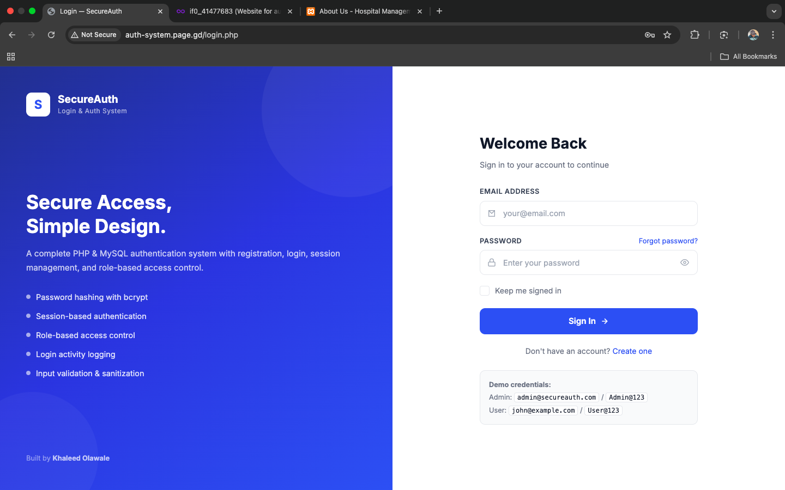
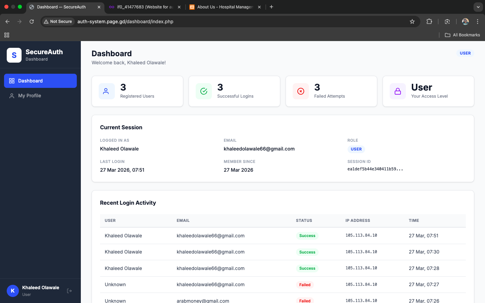

# SecureAuth — Login & Auth System

A complete PHP & MySQL authentication system with registration, login, session management, role-based access, and a user dashboard.

## Features
- Secure registration with password strength validation
- Login with bcrypt password verification
- Session-based authentication
- Role-based access (admin / user)
- Update profile & change password
- Login activity log
- Input sanitization & SQL injection prevention

## 🚀 Live Demo
https://auth-system.page.gd/

---

## 💻 GitHub Repository
https://github.com/khaleedolawale/auth-system

## Tech Stack
- PHP
- MySQL
- HTML5
- CSS3
- JavaScript

---

## 📸 Screenshot

## 📬 Contact
Feel free to reach out for collaboration, feedback, or inquiries.

---
